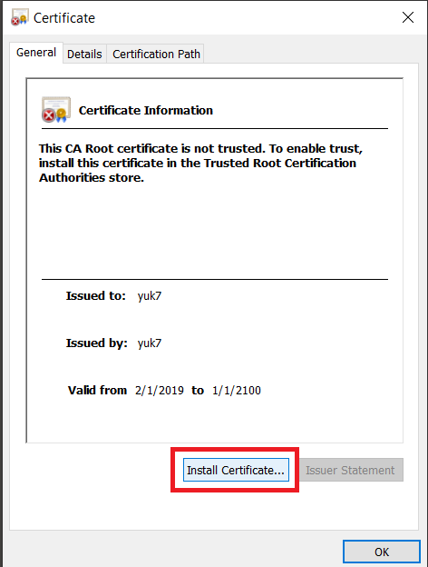
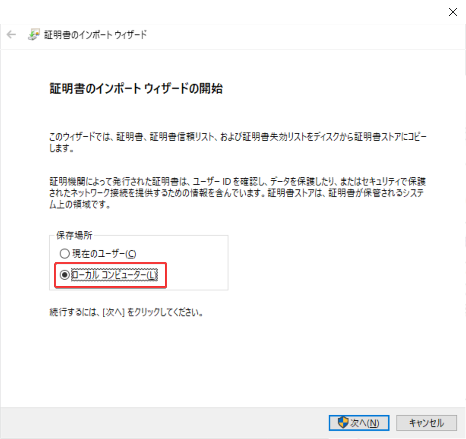
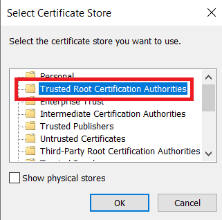

# Install Certificate for AppX

ArchWSL is not approved by Microsoft. Therefore, you will need to install a code
signing certificate manually if you want to install using the `.appx` package.
The certificate must be installed in the "Trusted Root Certificate Store" of the
local machine.

## Instructions

1. Open the .cer file and click "Install Certificate".

2. Select "Local Machine" and Next.

3. Select "Place ~ in the following store" and Click Browse to select installation destination.

4. Select "Trusted Root Certification Authorities" and OK.

5. done
