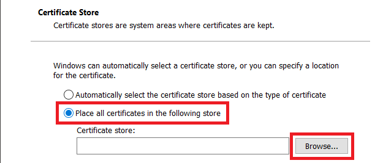

# AppX 설치용으로

ArchWSL 은 마이크로소프트로부터 인증받은 소프트웨어가 아닙니다. 그러므로, `.appx`를 설치하려면,
인증서 사인을 수동으로 해야 합니다.
인증서는 반드시 디바이스의 "신뢰할 수 있는 루트 인증 기관"에 설치되어야 합니다.

## 설치 단계

1. .cer 파일을 더블클릭하고 "인증서 설치"를 누릅니다.

2. "로컬 기기"를 선택하고 "다음"을 클릭합니다.

3. "~를 스토어에 설치하기" 를 선택하고 설치 경로로 들어갑니다.

4. "신뢰할 수 잇는 루트 인증 기관"을 선택하고 "확인"을 누릅니다.

5. 끝
