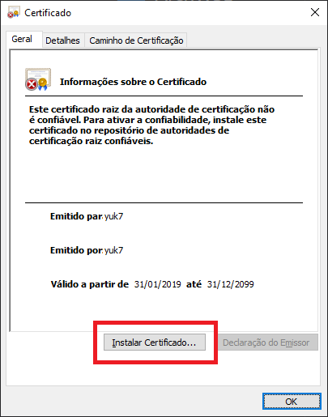
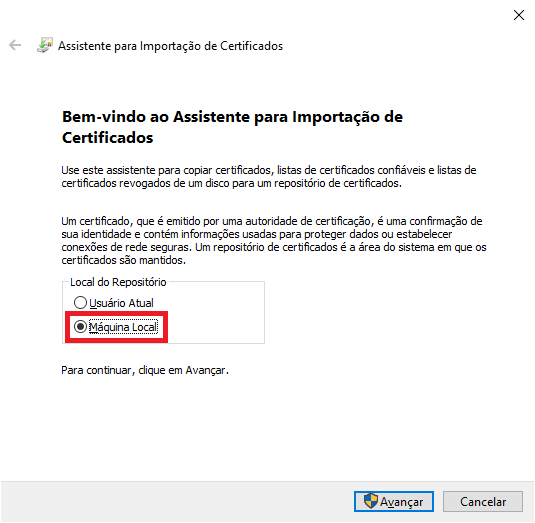

# Instalar certificado para AppX

ArchWSL não é aprovado pela Microsoft. Portanto, você precisará instalar um código
assinando o certificado manualmente se você deseja instalar usando o pacote `.appx`.
O certificado deve ser instalado no repositório de certificados "Pessoas Confiáveis"
da máquina local.

## Instruções

1. Abra o arquivo .cer e clique em "Instalar Certificado".

2. Selecione "Máquina Local" e Avançar.

3. Selecione "Colocar todos os certificados no repositório a seguir" e clique em Procurar para selecionar o destino da instalação.

4. Selecione "Pessoas Confiáveis" e OK.

5. feito