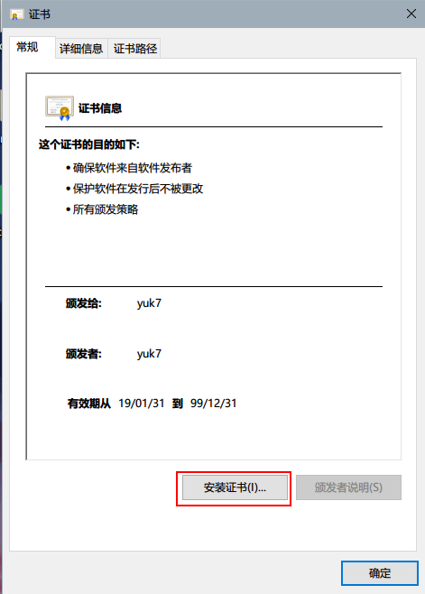
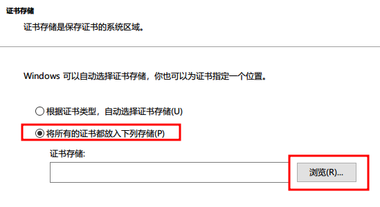
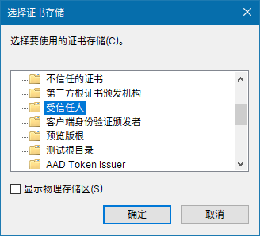

# 安装 AppX 的证书

ArchWSL 并不是 Microsoft 开发的。因此，你必须手动安装
一个代码签名证书才能正常使用 `.appx` 包。
这个证书需要被安装到本地计算机的“受信任人”存储区。

## 第一步

1. 打开 .cer 文件，然后点击“安装证书”。

2. 选择“本地计算机”，然后下一步。

3. 选择 “将所有的证书都放入下列存储”，然后点击“浏览”选择安装目标。

4. 现在选择“受信任人”。完成后点击确定。

5. 安装完成！
