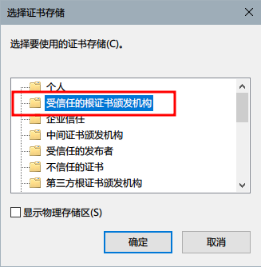

# 安装 AppX 的证书

ArchWSL 并不是 Microsoft 提供的，因此，你必须手动安装
一个代码签名证书才能正常使用 `.appx` 包。
这个证书必须被安装到 “本地计算机”的 “Trusted Root Certificate Store”。

## 第一步

1. 打开 .cer 文件，然后点击“安装证书”。

2. 选择“本地计算机”，然后下一步。

3. 选择 "将 ~ 放到如下储存中"，然后点击“浏览”选择安装目标。

4. 选择 "Trusted Root Certification Authorities" 然后点确定。

5. 完成！
