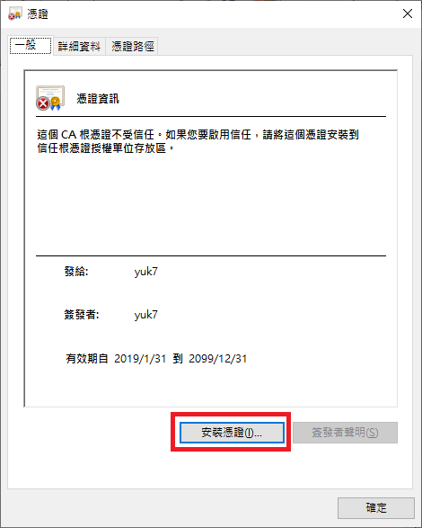
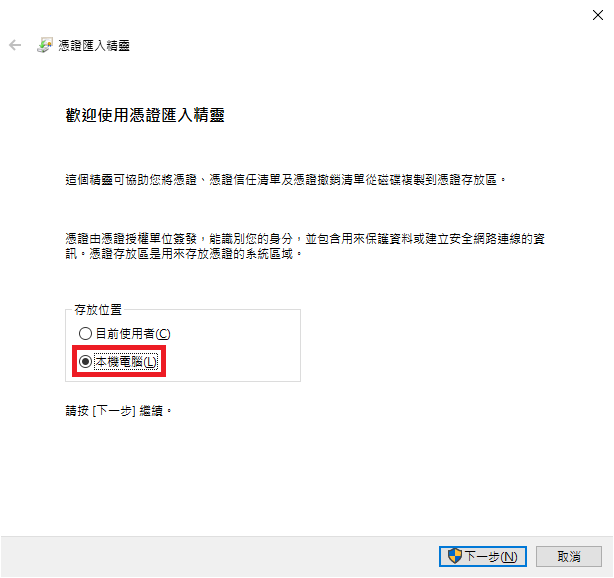
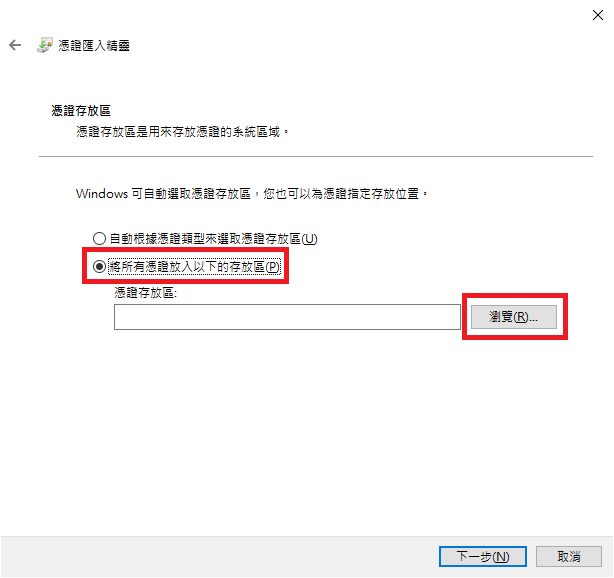
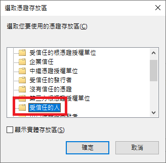

# 安裝 AppX 的憑證

ArchWSL 並不是 Microsoft 開發的。因此，你必須手動安裝一個代碼簽章憑證才能正常使用 `.appx` 包。
這個憑證需要被安裝到本機電腦的「受信任人」儲存區。

## 第一步

1. 打開 .cer 檔案，然後點選「安裝憑證」。

2. 選擇「本機電腦」，然後下一步。

3. 選擇 「將所有憑證放入以下的存放區」，然後點選「瀏覽」選擇安裝目標。

4. 現在選擇「受信任的人」。完成後點選確定。

5. 安裝完成！
